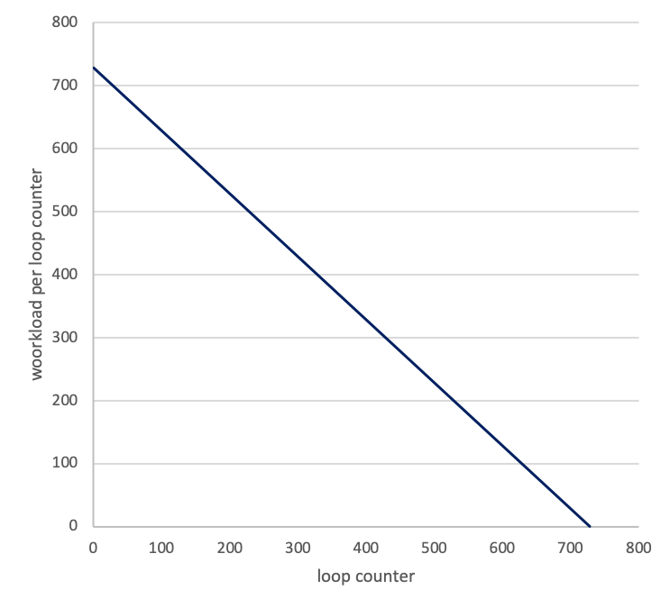
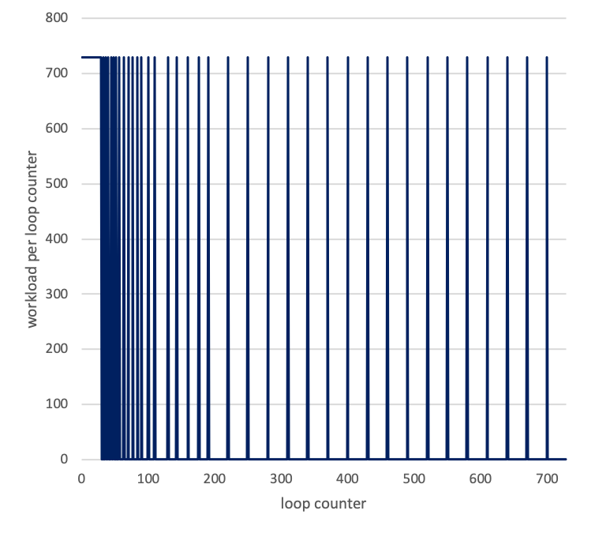
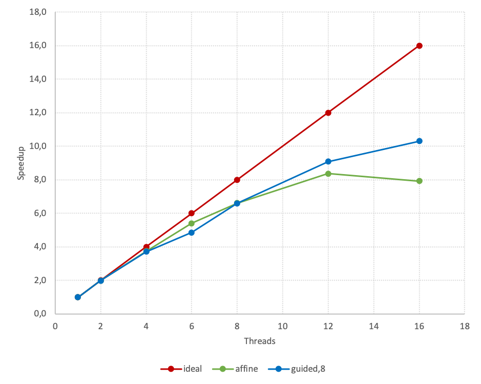
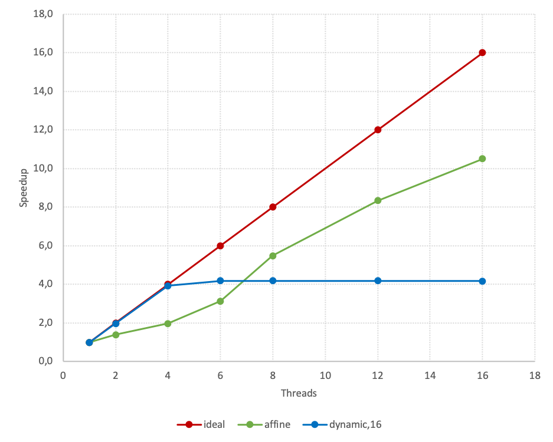

# Threaded Programming with OpenMP

Implementation and performance analysis of threaded programming shedules in OpenMP.

## Description

This project uses two distinct loops to analyse the performance of the various schedule clauses and the speedup gained by using an ever-increasing number of threads. The two loops have the following workload per loop counter:

 

The left figure shows workload of loop 1, the right figure shows workload of loop 2.

The loops can be inpected in more detail in the program files [`loop_schedules.c`](loop_schedules.c) and [`loops_affine.c`](loop_affine.c) or in any of the two provided reports [report schedules](report_shedules.pdf) and [report affine](report_affine.pdf).

We investigate the perfomance of the build in schedules
`auto` | `static` | `static,n` | `dynamic,n` | `guided,n`

as well as the self implemented schedule
`affine`

All performance runs were conducted on *Cirrus UK National Tier-2 HPC*. The achived speedup of the best perfoming build in schedule and the self implemented affine schedule are shown here:

 

The left figure shows the comparison of the actual and ideal speedup for loop 1 using the affine schedule and the guided schedule, while the right figure shows the comparison of the actual and ideal speedup for loop 2 using the affine schedule and the dynamic,16 schedule.

The project is described in detail in [report schedules](report_shedules.pdf) and [report affine](report_affine.pdf).

## Requirements

Compiler: gcc

## Run code

1. Change directory into `loop_schedules` or `loop_affine`

`$ cd loop_schedules`

2. Use Makefile to compile the code

`$ make`

3. Run the program

`$ ./loop_schedules`
